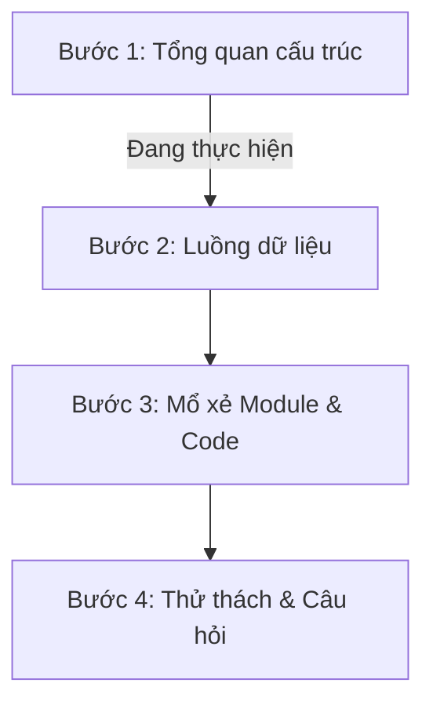

# Kế hoạch Đảo ngược Dự án (Reverse Engineering Plan) - E-Commerce Affiliate

Tài liệu này lưu trữ toàn bộ quá trình học tập, phân tích và "mổ xẻ" dự án E-Commerce Affiliate. Mục tiêu của chúng ta là đi sâu vào từng dòng code, hiểu rõ cấu trúc thư mục, luồng dữ liệu (Data Flow), tư duy thiết kế (Design Patterns) và các bài toán tối ưu.

> [!NOTE]
> File này dùng để theo dõi tiến độ. Khi đổi phiên chat hoặc đổi AI, bạn chỉ cần gửi file này cho AI mới để tiếp tục hành trình từ phần đang làm dở mà không lo bị trùng lặp.

---

## 📅 Tổng quan Tiến độ

- **Bắt đầu:** 23/05/2026
- **Trạng thái:** ⏳ Đang thực hiện (Bước 1: Tổng quan cấu trúc)
- **Giảng viên hướng dẫn:** Senior Fullstack Developer & Technical Lead

---

## 🗺️ Lộ trình 4 Bước chi tiết

### 🟩 Bước 1: Tổng quan cấu trúc (Folder Structure & Design Pattern)
- [ ] Phân tích cấu trúc thư mục Root
- [ ] Phân tích cấu trúc thư mục `backend/` (FastAPI)
- [ ] Phân tích cấu trúc các thư mục frontend (`frontend_user/`, `frontend_affiliate/`, `frontend_admin/`)
- [ ] Giải thích triết lý thiết kế (Modular Monolith, Layers Pattern, SPA, v.v.)
- [ ] Kiểm tra mức độ hiểu (Thử thách & Câu hỏi Bước 1)

### ⬜ Bước 2: Luồng dữ liệu (Data Flow)
- [ ] Phân tích luồng Đăng nhập/Đăng ký & Xác thực (JWT, CORS, Security Headers)
- [ ] Phân tích luồng Mua hàng & Tạo Đơn hàng (User -> Order -> Product/Variant -> DB)
- [ ] Phân tích luồng Affiliate (Click link -> Track click -> Tạo Conversion -> Tính Commission)
- [ ] Phân tích luồng Chat thời gian thực (Websockets / ChatSession & ChatMessage)
- [ ] Kiểm tra mức độ hiểu (Thử thách & Câu hỏi Bước 2)

### ⬜ Bước 3: Mổ xẻ từng Module / File cụ thể
Chúng ta sẽ đi qua từng Module cốt lõi ở Backend và Frontend:
#### Backend Modules (FastAPI + SQLAlchemy)
- [ ] **Core & DB:** `backend/app/core/` & `backend/app/db/` (Middleware, Security, Session DB)
- [ ] **Module User:** Đăng ký, đăng nhập, JWT Blacklist (`app/modules/user/`)
- [ ] **Module Product & Category:** Quản lý sản phẩm, biến thể (variants), phân loại (`app/modules/product/`, `app/modules/category/`)
- [ ] **Module Order & Coupon:** Quy trình đặt hàng, áp dụng mã giảm giá (`app/modules/order/`, `app/modules/coupon/`)
- [ ] **Module Affiliate:** Xử lý click, tính toán hoa hồng, chuyển đổi (`app/modules/affiliate/`)
- [ ] **Module Chat:** Quản lý hội thoại khách hàng - admin/affiliate (`app/modules/chat/`)

#### Frontend Modules (React + TypeScript + Vite)
- [ ] **Frontend User (Khách hàng):** Cấu trúc component, State Management, API integration
- [ ] **Frontend Affiliate (Cộng tác viên):** Dashboard thống kê hoa hồng, tạo link tiếp thị liên kết
- [ ] **Frontend Admin (Quản trị viên):** Quản lý sản phẩm, đơn hàng, người dùng, phê duyệt hoa hồng

### ⬜ Bước 4: Tổng kết & Thử thách Nâng cao
- [ ] Bài tập thực hành: Viết thêm một tính năng nhỏ hoặc tối ưu một phần hiệu năng cụ thể dựa trên kiến thức đã học.
- [ ] Đánh giá tổng quan năng lực đọc hiểu dự án.

---

## 📝 Nhật ký Chi tiết & Ghi chú các phiên làm việc

### Phiên 1 (23/05/2026): Khởi động & Bước 1: Tổng quan cấu trúc
- **Nội dung:**
  - Khởi tạo file kế hoạch `REVERSE_ENGINEERING_PLAN.md` để lưu vết tiến độ.
  - Quét toàn bộ thư mục dự án để tự động xây dựng sơ đồ cấu trúc (Folder Structure).
  - Phân tích chi tiết cấu trúc thư mục Root, Backend (`FastAPI`) và 3 Frontend (`Admin`, `Affiliate`, `User`).
  - Phân tích Design Pattern cốt lõi: **Modular Monolith** ở backend và **Component-based SPA** ở frontend.
- **Kết quả đạt được:** [Đang cập nhật...]
- **Câu hỏi thử thách dành cho bạn:** [Đang cập nhật...]
- **Ghi chú/Phản hồi từ bạn:** [Đang cập nhật...]
